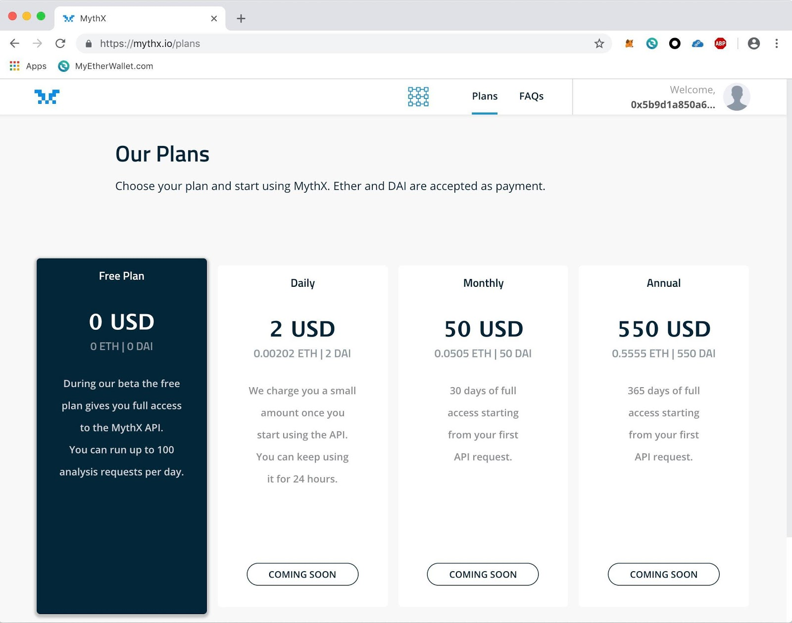
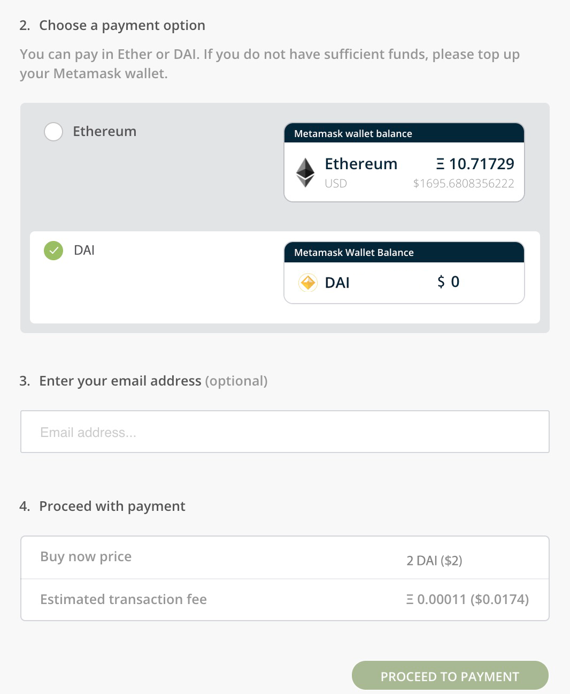
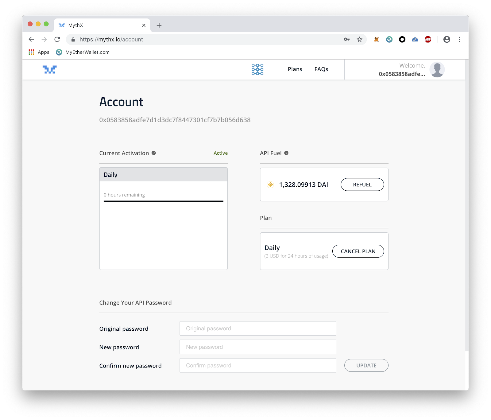

.. contents:: :local:

Getting Started with MythX
===========================

MythX is a SaaS product. You will need to navigate to https://mythx.io/
and create a user account.

.. image:: _static/mythx-main-page.png

Sign up
-------
The signup process starts by clicking the “Login with Metamask” button on the
MythX website.

.. image:: _static/mythx-metamask-login.jpg

Login
-----

On first login the user is asked to set up an API password. The user’s Ethereum
address and API password later serve as credentials for accessing the API:

- *Username:* The user’s Ethereum address
- *Password:* Chosen by the user on first signup

.. image:: _static/mythx-password.png

Pick a Plan
-----------

New users will be directed to the license plans page. Here you can start with
a free plan. Later you can have the option to upgrade to one of several paid
plans which offer you unlimited analysis of smart contracts per day.

Pay and Get Started
-------------------

Payment is accepted in Ether or DAI. Note that prices are pegged to DAI, so
prices in other currencies are calculated dynamically and your payments is
converted to DAI automatically upon the selection of your payment option.

A Note on Payments
^^^^^^^^^^^^^^^^^^

When you purchase a plan any unused DAI will be refunded if and when the
users chooses to cancels the subscription. For example:

A user can choose 10x daily plan which fills their “fuel tank” with 10 DAI.
The MythX API tracks usage of the account and 1 DAI is burned for each 24
hours activation. Unused DAI are refunded if and when a user cancels their
subscription.

Ready to start security analysis of your smart contracts
^^^^^^^^^^^^^^^^^^^^^^^^^^^^^^^^^^^^^^^^^^^^^^^^^^^^^^^^
Now that you have created your MythX account and chosen a subscription plan
you are ready to begin experiencing the power of the MythX. In the next
section of this developer user guide you will see three example use cases
showing how you as a developer can use MythX to thoroughly analyze your
Ethereum smart contracts.

