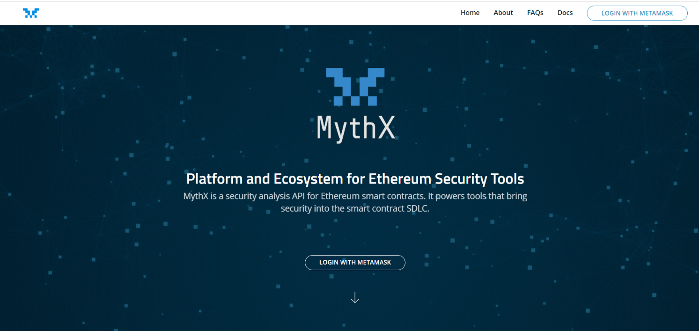
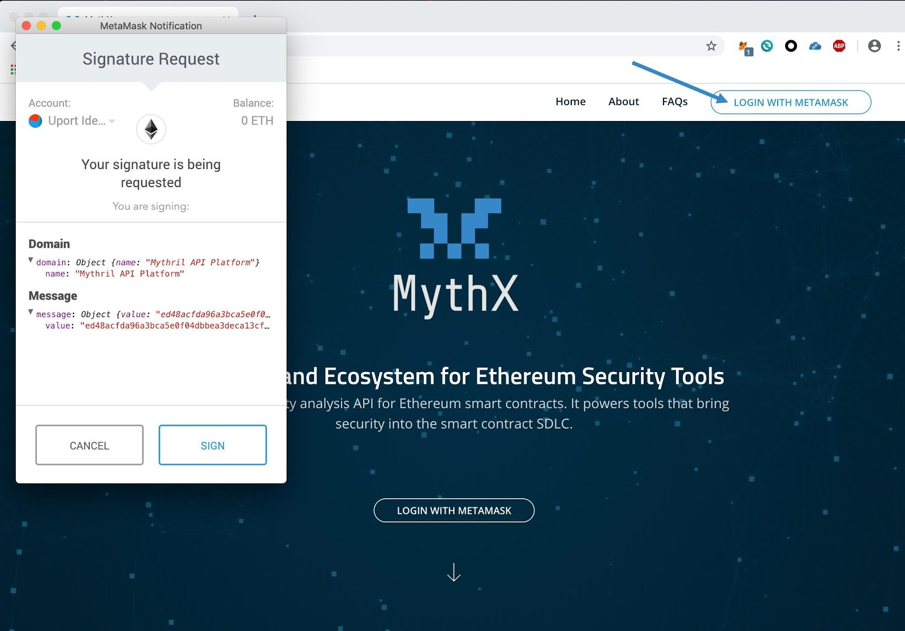
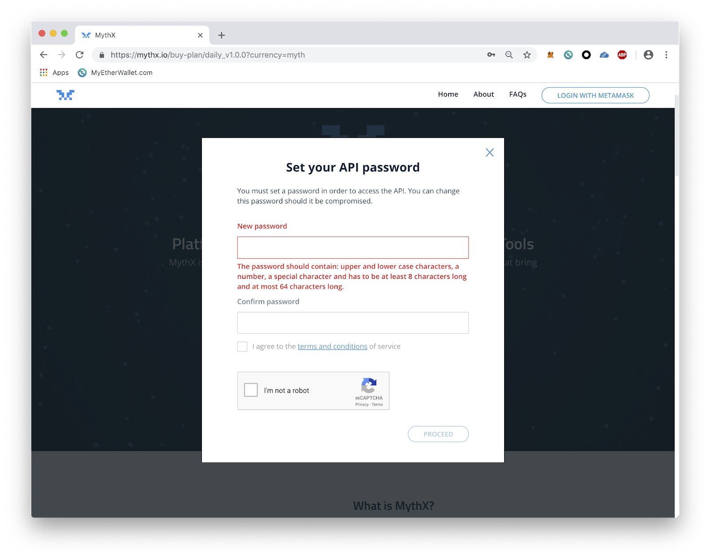

Getting Started
===============

What is MythX?
--------------
`MythX <https://mythx.io>`_ is a security analysis API for Ethereum Smart
Contracts. It is aimed at smart contract developers to tailor security into
their Software Development Lifecycle as well as Smart Contract auditors. By
providing an easy-to-use endpoint to in-depth security analysis, MythX is
meant to turbocharge the rapid development of applications for the Ethereum
blockchain in a sustainable and secure way.

For more information, announcements and support, consider joining the
`MythX Discord <https://discord.gg/kktn8Wt>`_ server.

Obtaining API Credentials
-------------------------

A user account is required top use the MythX API. To get your free account, 
you have to visit the the `MythX website <https://mythx.io>`_ with a web3-enabled
browser. Need a step-by-step guide? Continue reading!

The sign-up process starts by clicking the “Login with Metamask” button on the
MythX website.

On first login you'll be asked to set up an API password. You Ethereum
address and API password later serve as credentials for accessing the API:

- *Username:* Your Ethereum address
- *Password:* Chosen by the user on first sign-up

Once the password is set you should be redirected to a plans page. Only
the free plan is available during the beta.

Getting Support
---------------
There are multiple ways to get in touch with us, whether you want to get
help using MythX, you need support, or want to give feedback.

Helpdesk
^^^^^^^^
You can reach us officially at `support [at] mythx.io` to notify us of any
issues or potential bugs you might run into regarding MythX.

Discord
^^^^^^^
To communicate with our community and contributors more efficiently, we have set
up a Discord server. This allows us to separate discussion topics into
channels, keep things on-topic and quickly give support in case problems occur.
Interested in speeding up your communication with us, whether it's about
questions, support or contributions? Check out the
`invite link <https://discord.gg/E3YrVtG>`_ and get typing! We are also
using Discord to make regular announcements on improvements regarding MythX and
the tools we are actively developing around it.

Contributing to this Document
^^^^^^^^^^^^^^^^^^^^^^^^^^^^^

We are hosting this developer guide in a public `Github repository
<https://github.com/ConsenSys/mythx-developer-guide>`_. Found a typo? Decided to
write a major section about your favourite part of our stack? Submit your own
MythX-enabled tool? Simply fork the repository and open up a pull request for
us. Want to make your reviewer smile? Check out the contribution guidelines
and try to stick to them. They're short and simple, promise!
