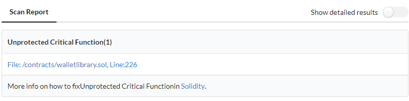

.. meta::
   :description: Learn how to setup & use GuardRails, a service that provides continuous security feedback for your GitHub repositories

.. _tools.guardrails:

GuardRails
==========

GuardRails is a service that provides continuous security feedback for your GitHub repositories.

.. image:: img/guardrails.png

What is GuardRails?
-------------------

`GuardRails <https://guardrails.io>`_ makes open-source security tools easily available in your GitHub pull requests. It has been tuned to keep the noise low and only report high-impact and relevant security issues.

Installing and configuring security tools, even for one repository, typically takes a lot of time and effort. GuardRails makes that process painless and rewarding for developers.

GuardRails can be installed across all your repositories in minutes. Once installed, GuardRails identifies security problems in your codebase and helps you fix them.

In addition, GuardRails leverages the power of MythX in order to scan for security vulnerabilities in your smart contracts.

Setup
-----

To view to latest setup instructions for GuardRails, please see their `Getting Started <https://www.guardrails.io/docs/en/getting-started>`_ page.

.. note:: The free version of GuardRails only works with public repositories.

MythX comes built-in to GuardRails integration; **no special installation is required.**

Configuration
-------------

By default GuardRails will decide how to analyze based on the code tag on the repository. Solidity isn't always caught correctly, but you can set the `bundle` setting default to `solidity` in the `Dashboard <https://dashboard.guardrails.io/>`_.

.. note:: `View all GuardRails configuration options <https://www.guardrails.io/docs/en/configuration>`_.

Scanning
--------

Once GuardRails is properly configured, whenever a pull request is created on a branch, GuardRails will start a scan in the comments. This scan may take some time, especially if you have multiple languages or multiple smart contracts. 

When completed, you will see the results of the scan in the pull request:

.. figure:: img/guardrails-scan.png

You can see more detailed information about the issue and where it came from by clicking :guilabel:`Details` to see the scan report in the GuardRails dashboard:

.. seealso::

  * `GuardRails dashboard <https://dashboard.guardrails.io/>`_
  * `GuardRails configuration <https://www.guardrails.io/docs/en/configuration>`_

