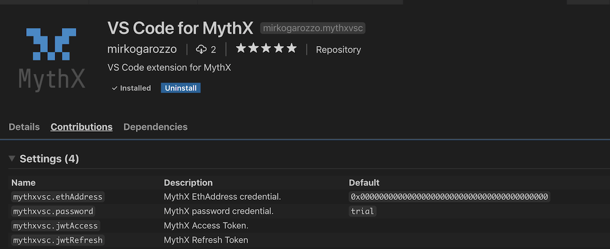
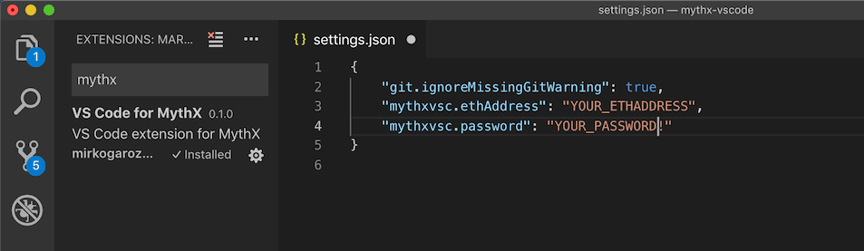

.. meta::
   :description: MythXvsc is an extension for running MythX smart contract analysis from VS Code. 
   
.. _tools.mythxvsc:

VS Code
=======

MythXvsc is an extension for running MythX smart contract analysis from Visual Studio Code.

The extension provides:

- Smart contract compilation (via the Solidity VS Code extension)
- Authentication to the MythX platform
- AST extraction from compiled source
- Submission of analysis
- Displaying analysis result in VS Code in a linting fashion

Dependencies
------------

The MythXvsc extension depends on the `Solidity extension`_ by Juan Blanco. Make sure to download this from Visual Studio Code Marketplace before installing MythXvsc.

.. _Solidity extension: https://marketplace.visualstudio.com/items?itemName=JuanBlanco.solidity

Installation
------------

Install_ from the Visual Studio marketplace.

.. _Install: https://marketplace.visualstudio.com/items?itemName=mirkogarozzo.mythxvsc

Setup
-----
After installing the extension, please enter your registered MythX Ethereum address and password in the VS Code user settings. These fields are properties of the extension as shown in the screenshots below:

.. warning:: 

 Please note that the credentials stored this way are exposed to VS Code. Be sure to understand the security risk this entails or contact the extension developers if you don't.

 In the future, we will be releasing a more robust login implementation via a single token, which will better protect your credentials.

If no Ethereum address and/or password are provided, the extension will fallback to use Trial Mode.

Usage
-----

Open a Solidity file from inside a folder or workspace, and click the :guilabel:`MythX: Analyze smart contract` button that you will see in the top right of your IDE window. Otherwise, right click with your mouse on the contract name and you will see the command there.

.. image:: img/button_one.png
.. image:: img/right_click.png

Once the solidity compilation is done, you will be asked to pick a contract from a dropdown list of contracts that exist in the compiled AST. Please make sure to pick the main contract to avoid inconsistent results. 

.. image:: img/contract_picker.png

Once the analysis is over, you will see your smart contract issues highlighted in your code. The exact time it takes to perform an analysis will depend on the plan associated with your account.

.. note:: Please see the `MythX Pricing <https://mythx.io/plans>`_ page for details on plans.

.. image:: img/finished_analysis.png
