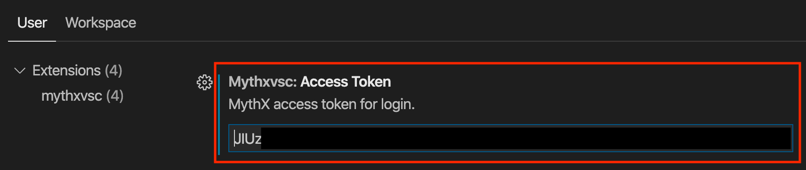
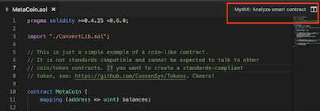
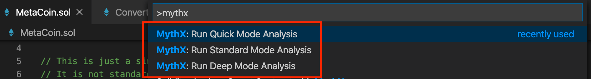
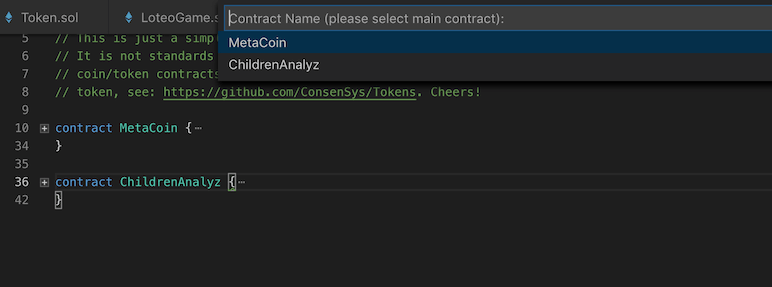

.. meta::
   :description: MythXvsc is an extension for running MythX smart contract analysis from VS Code. 
   
.. _tools.mythxvsc:

VS Code
=======

MythXvsc is an extension for running MythX smart contract analysis from Visual Studio Code.

The extension provides:

- Smart contract compilation (via the Solidity VS Code extension)
- Authentication to the MythX platform
- AST extraction from compiled source
- Submission of analysis
- Displaying analysis result in VS Code in a linting fashion

You need to sign up for a MythX account in order to use the MythX extension for VS Code. Your account, once verified, is on the Free plan.

MythX offers both free and paid plans. For information on plans and features, please see our `plans <https://mythx.io/plans/>`_ page. 

Dependencies
------------

The MythXvsc extension depends on the `Solidity extension`_ by Juan Blanco. Make sure to download this from Visual Studio Code Marketplace before installing MythXvsc.

.. _Solidity extension: https://marketplace.visualstudio.com/items?itemName=JuanBlanco.solidity

Installation
------------

Install_ from the Visual Studio marketplace.

.. _Install: https://marketplace.visualstudio.com/items?itemName=mirkogarozzo.mythxvsc

Authentication
--------------

MythX uses an API key for authentication. Once your account is set up, head over to the `dashboard <https://dashboard.mythx.io/>`_. In the *Profile* section there is an element labeled :guilabel:`MythX API Key`. Generate a new API key by entering your account password:

.. image:: img/api-key-password.png

On successful authentication, a new API key is generated, which can be used for further authentication by API clients. It will only be shown once, and can be copied using the icon on the right of the truncated secret string. If the token is lost, a new one can be generated again in the same way as explained above.

.. image:: img/api-key.png

After installing the extension, copy the token and paste it in the VS Code user settings as shown below.

.. warning:: 

 Authentication via Ethereum address/Username and password is deprecated. Please note that the credentials stored this way are exposed to VS Code. Be sure to understand the security risk this entails or contact the extension developers if you don’t.

Usage
-----

Open a Solidity file from inside a folder or workspace, and click the :guilabel:`MythX: Analyze smart contract` button that you will see in the top right of your IDE window. Otherwise, right click with your mouse on the contract name and you will see the command there.

.. image:: img/right_click.png

MythX allows users to choose from three different scan modes. This extension supports all three. 

.. note:: Refer to the `plans <https://mythx.io/plans/>`_ page to see which plan you need for each mode. 

Once the solidity compilation is done, you will be asked to pick a contract from a dropdown list of contracts that exist in the compiled AST. Please make sure to pick the main contract to avoid inconsistent results. 

Once the analysis is over, you will see your smart contract issues highlighted in your code. The exact time it takes to perform an analysis will depend on the mode selected & the plan associated with your account.

.. image:: img/finished_analysis.png
