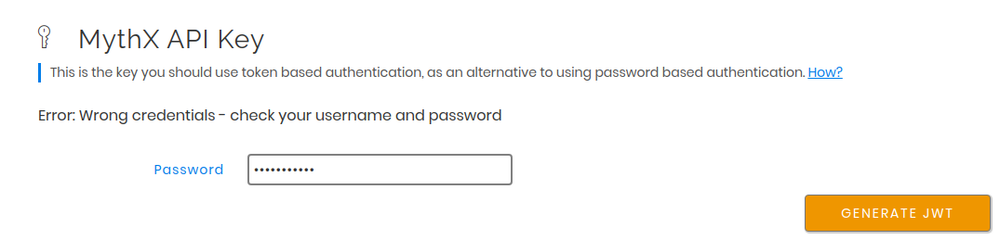

.. meta::
   :description: How to activate the MythX plugin for Remix, a popular web-based IDE for smart contract development and deployment, which is created and hosted by the Ethereum Foundation.

.. _tools.remix:

Remix integration with MythX
============================

MythX is available as a plugin for `Remix <https://remix.ethereum.org>`_, a popular web-based IDE for smart contract development and deployment, created and hosted by the Ethereum Foundation.

.. image:: img/remix.jpg

Setup
-----

.. note:: These instructions will show the Remix interface that is current as of early 2020. We recommend everyone use this interface.

Because Remix is a web-based interface, no local installation is required. However, MythX will need to be specifically activated from within the Remix Plugin Manager before use.

To activate MythX in Remix:

#. Click the :guilabel:`Plugins` icon (which resembles a plug).

   .. figure:: img/pluginsbutton.png

   Alternately, click the :guilabel:`See all Plugins` button under :guilabel:`Featured Plugins`.

#. The full list of plugins for Remix will be displayed. Scroll down to the entry titled :guilabel:`MythX Security Verification` and click :guilabel:`Activate`.

   .. figure:: img/remix-module-deactivated.png

   If done correctly, the plugin will be listed under :guilabel:`Active Modules` and the MythX icon will be shown in the sidebar.

   .. figure:: img/remix-module-activated.png

Authentication
--------------

#. Click the MythX logo and then MythX settings within the plugin to enter your MythX credentials. 

MythX uses an API key for authentication. This API key can be generated in your `dashboard <https://dashboard.mythx.io/>`_. In the Profile tab there is a section titled :guilabel:`MythX API Key`. Generate a new API key by entering your account password:

On successful authentication, a new API key is generated, which can be used for further authentication by API clients. It will only be shown once, and can be copied using the icon on the right of the truncated secret string. If the token is lost, a new one can be generated again in the same way as explained above.

.. figure:: img/API key2.png

Usage
-----

You can perform a security analysis on any contract in any open file on Remix.

To perform an analysis:

#. Click the MythX logo on the sidebar to open the MythX control panel (if it isn't already open).

#. Below the credentials section, there will be a box containing a list of all applicable contracts. Select the contract you wish to analyze and click the :guilabel:`Analyze` button. You can also select the scan mode as shown below:

   .. figure:: img/remixscanmodes.png

   .. note:: Different plans have access to different modes. Please refer to the MythX `Pricing <https://mythx.io/plans/>`_ page to see which plan you need for each mode.

   .. note:: The contract may need to be compiled first, depending on the current Remix settings. Make sure the :guilabel:`Solidity Compiler` plugin for Remix is activated in your project. You will have to click the Solidity icon and then click the :guilabel:`Compile` button for your contract.

#. Depending on the scan mode selected, the analysis may take a few minutes. When completed, a list of vulnerabilities will be displayed, along with a link to the `SWC Registry <https://smartcontractsecurity.github.io/SWC-registry/>`_ for each vulnerability found.

   .. figure:: img/results.png

.. seealso::

  * `Remix MythX plugin README (GitHub) <https://github.com/aquiladev/remix-mythx-plugin/blob/master/README.md>`_

